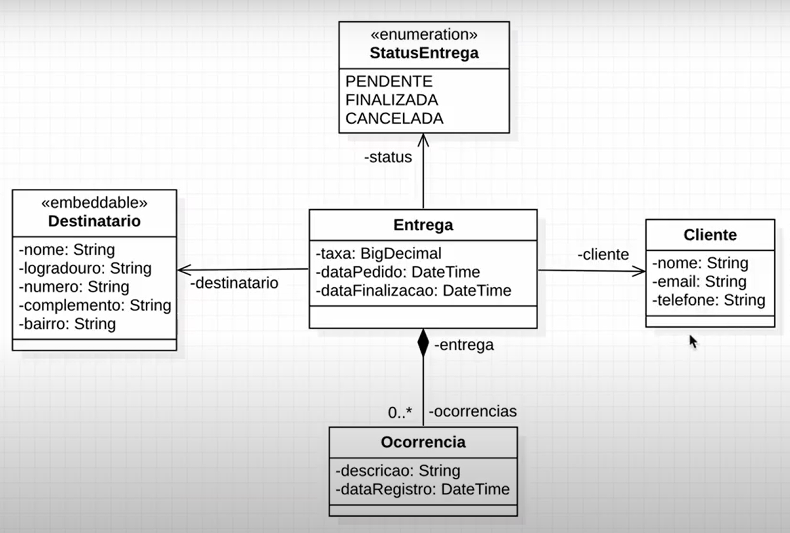

# Delivery API

# Sobre o Projeto:

Logística é uma API REST desenvolvida na qual os clientes podem solicitar um serviço de entrega para um endereço final de um destinatário. Sendo que cada entrega possui ocorrências, sejam elas de tentativa de entrega sem sucesso, com sucesso e/ou não encontrada por não existir entrega para tal endereço. Cada entrega também possui o status da mesma, sendo eles de PENDENTE, FINALIZADA e CANCELADA.

### 👨‍💻 Modelo Lógico:

<div align="center">

</div>
<hr>

### 📌 Features

- [x] CRUD de cliente
- [x] CRUD de entrega
- [x] Cadastro e Listagem de ocorrências
- [x] Cadastro de Destinatário
- [x] Status PENDENTE
- [x] Status FINALIZADA
- [x] Status CANCELADA
<hr>

### 🔧 Pré-requisitos:

Antes de começar, você vai precisar ter instalado em sua máquina as seguintes ferramentas:
[Git](https://git-scm.com), [JDK 11 ou Superior](https://jdk.java.net/18/), [PostgreSQL](https://www.postgresql.org/download/).
Além disto é bom ter um editor para trabalhar com o código como [Spring Tools Suite](https://spring.io/tools) ou [Intellij](https://www.jetbrains.com/idea/download/).

```bash
#Clonar o repositório;

#Abra sua IDE e clone o repositório usando o link abaixo;
<https://github.com/JailtonArauj0/deliveryAPI>

#Abra o Postgresql e crie um database e atualize os dados no application.properties;

#Defina a URL, Usuário e senha do seu Postgresql no application.properties;

# E para rodar o projeto, execute a classe:
DeliveryApiApplication
```

### 🛠 Tecnologias utilizadas:
- Java
- Spring Boot
- Spring Data JPA
- Jakarta Bean Validation
- Maven
- Lombok
<hr>

### ⚙️ Arquitetura:
- REST


### ✏️ Autor


<br>
<br>
<a href="https://github.com/JailtonArauj0">Jailton Araújo</a>

<br>

[](https://www.linkedin.com/in/jailton-araujo/)

<hr>

